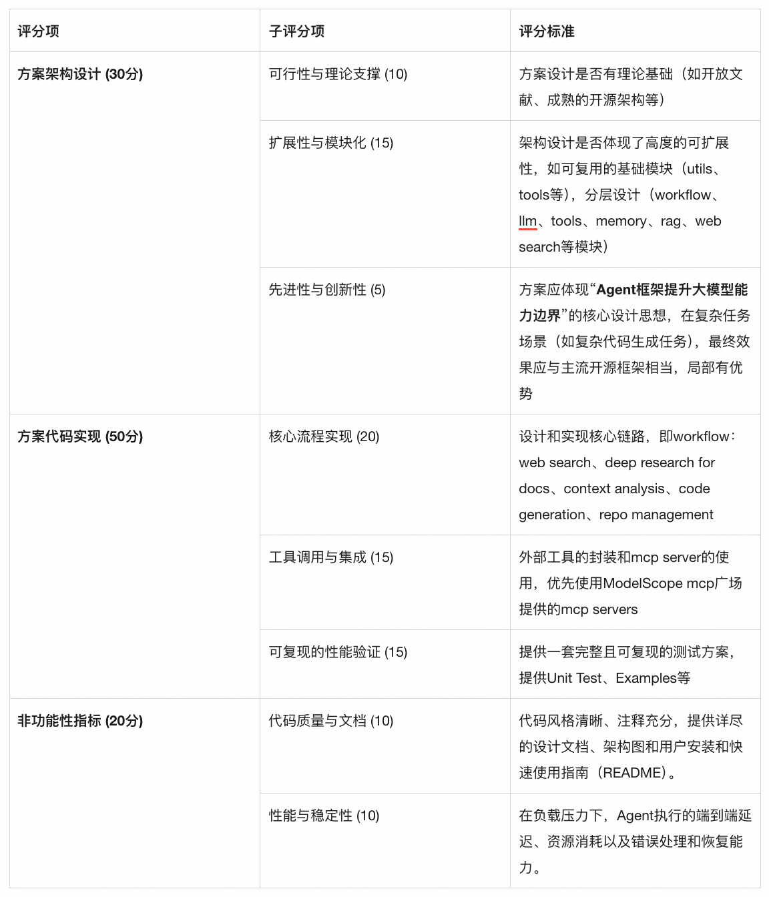

赛题3：复杂代码生成DeepCodeResearch

赛题描述

本赛题要求参赛者设计并实现复杂代码生成任务，让智能体先做自主研究，再设计和实现项目代码。

支持多技术文档输入，如方案详细设计文档、paper、流程图、技术框图等形式；文档类型涵盖PDF、PPT、DOCX、TXT等格式

先做深度研究，再做代码生成

支持web search

产出repo-level code

自主探索、自主设计、自主编码实现/调试/修复

支持human-in-the-loop

技术考察点：

Agent对于外部文档/知识库的自主深度理解和洞察的能力

多模态知识检索的能力（Multimodal RAG）

长短期记忆依赖与超长上下文管理

Code Agent的自我反思能力（bug shooting）

技术要求与架构参考

参赛者应借鉴最新的AI Agent学术研究和工程实践，设计方案可以参考以下内容（不限于）：

Agent架构：设计应遵循现代Agent架构的核心原则，如明确分离规划器（Planner）、执行器（Executor）和记忆（Memory）模块，以实现逻辑解耦和功能模块化。

框架可扩展性：Agent运行时必须具备高度的可扩展性，允许开发者在不修改核心代码的情况下注入自定义逻辑。例如可以通过设计良好的钩子（Hooks）系统（如pre-execution、post-execution、tool-invocation等生命周期钩子）和插件化（Pluggable）架构（支持动态加载新的工具、记忆存储或LLM封装器）来实现。

通用工具调用协议：插件需要实现一个通用的远程工具调用机制，能够无缝对接任意实现了模型上下文协议（Model Context Protocol, MCP）的服务。该机制应具备良好的抽象性，例如通过解析OpenAPI规范自动生成工具定义，并内置健壮的认证授权管理能力，以安全地与外部API交互。

赛题评审标准

基于MS-Agent框架的DeepCodeResearch的DEMO演示和相关组件依赖

需要研究的目标文档（包括技术文档、架构图、paper等）

Coding题目详情

