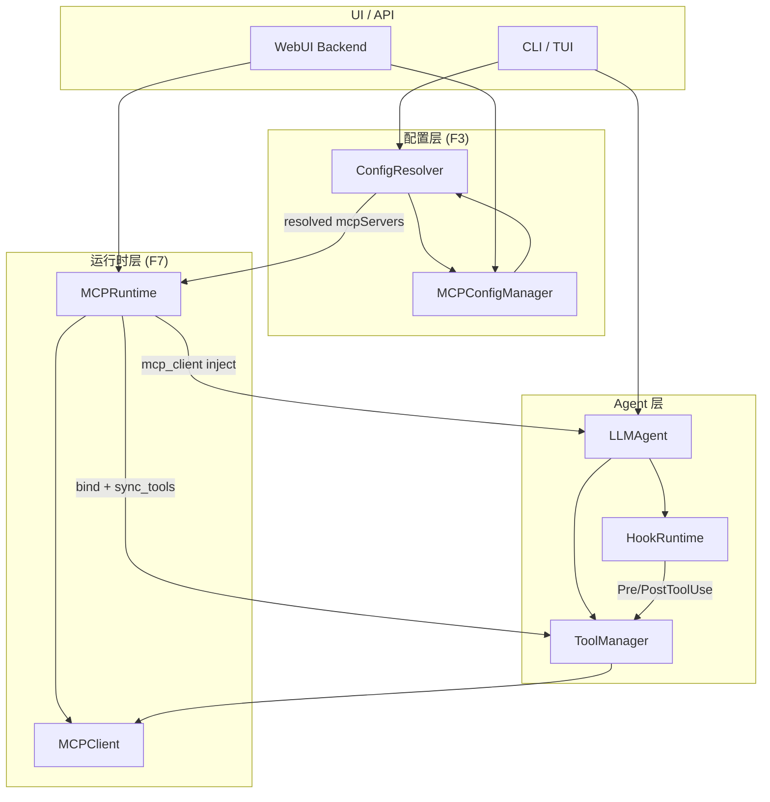

# MCP 运行时管理 — 方案设计

> 基于 [`playground_prototype_design.md`](../../playground_prototype_design.md) F3（分层配置）与 F7（Skill / MCP 运行时管理）细化；Hooks 集成对齐 [`hooks-design.md`](../zh/design/hooks-design.md)（F6，已落地）。
>
> 状态：方案设计 v0.5 | 2026-06-16

---

## 1. 背景与目标

实验场（Playground）需要支持：

| 能力 | 产品语义 |
|------|----------|
| 配置分层 | 全局 → 项目 → session 多级合并，MCP server 按 name 并集去重 |
| 持久化 CRUD | UI / CLI 可增删改 MCP server 定义，写入 `~/.ms_agent/` 或项目 `.ms-agent/` |
| 运行时开关 | `enabled: false` 的 server **完全不可用**（不出现在 tool 列表、不可被调用） |
| 热更新 | 修改配置或切换 enabled 后，无需重启整个 Agent 进程即可生效 |
| 多形态复用 | 同一套能力供 WebUI、TUI、CLI、Workflow 共用 |

**核心结论（回应「MCP 原本就可以独立初始化」）**：

现有 `MCPClient` **已经**是一个可独立创建、连接、复用的 MCP 连接层；`LLMAgent` / `ToolManager` 也支持外部注入。F7 不应重写连接逻辑，而是在此之上补齐 **配置持久化 + 运行时状态机 + ToolManager 索引同步**。

---

## 2. 现状分析

### 2.1 已有能力（可直接复用）

#### MCPClient — 独立初始化

`ms_agent/tools/mcp_client.py` 的 `MCPClient` 继承 `ToolBase`，**不依赖** `LLMAgent` 即可使用：

```python
# 方式 1：async context manager
async with MCPClient(mcp_config) as client:
    tools = await client.get_tools()

# 方式 2：手动生命周期
client = MCPClient(mcp_config)
await client.connect()
await client.cleanup()

# 方式 3：运行时增量添加
await client.add_mcp_config(extra_config)
```

单元测试 `tests/tools/test_mcp_client.py::test_outside_init` 专门验证了「Agent 外部独立初始化」场景。

#### 外部注入链路

```
MCPClient (可选，外部创建)
    ↓ mcp_client=
LLMAgent.__init__
    ↓ prepare_tools()
ToolManager(mcp_config, mcp_client)
    ↓ connect()
    ├─ 有外部 client → 复用，调用 add_mcp_config 合并增量配置
    └─ 无外部 client → 内部 new MCPClient 并 connect
```

关键代码路径：

| 组件 | 行为 |
|------|------|
| `LLMAgent` | `kwargs['mcp_client']` 透传；`parse_mcp_servers()` 支持 `mcp_server_file` + 内联 `mcp_config` 合并 |
| `ToolManager` | `_managed_client = (mcp_client is None)`；外部 client 时 **不** 在 `cleanup()` 中断开连接；**已集成** `hook_runtime` + SafetyGuard + PermissionEnforcer（见 hooks-design §10） |
| `MCPClient` | 构造时可同时接收 `config`（agent.yaml tools）和 `mcp_config`（JSON 格式） |
| `Config.convert_mcp_servers_to_json` | 将 agent.yaml 中 `mcp: true` 的 tool 条目转为 `mcpServers` 字典 |

#### 配置来源（当前分散）

| 来源 | 格式 | 消费方 |
|------|------|--------|
| `agent.yaml` → `tools.*`（`mcp: true`） | YAML | `MCPClient(config=...)` |
| CLI `--mcp_config` / `mcp_server_file` | JSON 文件 | `LLMAgent.parse_mcp_servers` |
| WebUI `ConfigManager` | `~/.ms_agent/config.json` → `mcp_servers` | 仅 WebUI 层，未接入 SDK |
| 运行时 `mcp_config` 参数 | `{"mcpServers": {...}}` | `LLMAgent` / `MCPClient` |

### 2.2 缺口（F7 需补齐）

| 缺口 | 说明 |
|------|------|
| 无 `MCPRuntime` | 缺少统一的运行时状态机封装 |
| 无 per-server `enabled` | 配置和运行时均不支持开关 |
| 无 `disconnect_server` | `MCPClient` 只有 `add_mcp_config` / 全局 `cleanup`，无法单 server 下线 |
| 无 `MCPConfigManager` | 仅有 WebUI 侧简单 CRUD，无全局/项目分层、无与 ConfigResolver 集成 |
| ToolManager 无动态 reindex API | `reindex_tool()` **只追加、不清除** `_tool_index`；重复调用会触发 duplicate assert；无「移除 disabled server 工具」的公开接口 |
| 配置语义不统一 | YAML tools 与 JSON mcpServers 两套格式，缺少归一化层 |
| Session 级覆盖未定义 | F3 提到 session 层，MCP 热更新时 session 与全局的生效边界未明确 |

---

## 3. 设计原则

1. **连接与治理分离**：`MCPClient` = 传输连接；`MCPRuntime` = 启停/开关/状态；`MCPConfigManager` = 持久化 CRUD；`ConfigResolver` = 多层合并。
2. **注入优先于自建**：Session / Workflow 多 Agent 共享连接时，由上层创建 `MCPClient` 并注入，避免重复拉起 stdio 子进程。
3. **软禁用优先、硬断开按需**：一期 `enabled=false` 通过 ToolManager 索引过滤即可满足「完全不可用」；二期再补 per-server 硬断开以释放资源。
4. **不破坏 CLI 兼容**：`Config.from_task()` 路径保持不变；新能力通过 `ConfigResolver` + `MCPRuntime` 供 Playground 使用。
5. **连接只发生一次（模式 A）**：Playground 由 `MCPRuntime.start()` 独占 connect；`ToolManager` 注入外部 client 且 `mcp_config` 为空时不再 `add_mcp_config`。
6. **单向依赖**：`MCPRuntime → ToolManager`（`bind_tool_manager` + `sync_tools`）；`ToolManager` 不引用 `MCPRuntime`，失败上报走可选 `mcp_failure_handler` 回调。
7. **部分失败可启动**：`connect_policy=skip`（默认）— 单 server 连接失败不阻断 Agent；`fail_fast` 保留给 CLI。
8. **与 Hooks 分治、管线协作**：`MCPRuntime` 与 `HookRuntime`（F6）**不合并**；`ToolManager` 可持有 `hook_runtime`（已有），MCP 通过 `mcp_callable_check` / `mcp_failure_handler` 回调接入；MCP `degraded` 检查须在 PreToolUse **之前**（见 §7.4）。

---

## 4. 总体架构



### 4.1 模块职责

| 模块 | 路径（建议） | 职责 |
|------|-------------|------|
| `MCPConfigManager` | `ms_agent/config/mcp_manager.py` | 全局/项目 MCP 条目 CRUD、`enabled` 持久化、导入导出 |
| `ConfigResolver` | `ms_agent/config/resolver.py` | 五层合并，输出归一化后的 `ResolvedMCPConfig` |
| `MCPRuntime` | `ms_agent/mcp/runtime.py` | 连接状态机、`connect_policy`、enable/disable、reload、`sync_tools`（持 `_sync_lock`） |
| `MCPClient` | `ms_agent/tools/mcp_client.py` | **保持现有**，小幅增强 per-server 操作 |
| `ToolManager` | `ms_agent/tools/tool_manager.py` | 已有 `hook_runtime`；新增 `_clear_mcp_index_entries` + `sync_mcp_tools()`、`mcp_callable_check` / `mcp_failure_handler` 回调；**不**持有 `MCPRuntime` |
| `HookRuntime` | `ms_agent/hooks/runtime.py` | F6 已落地；Pre/PostToolUse 嵌入 `single_call_tool`；与 MCP 分治 |

---

## 5. 配置模型

### 5.1 归一化 Schema

所有来源最终合并为：

```json
{
  "mcpServers": {
    "<server_name>": {
      "enabled": true,
      "transport": "stdio | sse | streamable_http | websocket",
      "command": "npx",
      "args": ["-y", "@modelcontextprotocol/server-filesystem", "/path"],
      "url": "https://...",
      "env": {"API_KEY": ""},
      "headers": {},
      "timeout": 120,
      "include": ["tool_a"],
      "exclude": ["tool_b"],
      "source": "global | project | agent_yaml | plugin",
      "meta": {
        "description": "",
        "added_at": "2026-06-15T00:00:00Z"
      }
    }
  }
}
```

**字段说明**：

- `enabled`：**用户配置意图**，默认 `true`；`false` 时不出现在 tool 列表、不主动连接。不因连接/调用失败自动改写。
- `mcp`（agent.yaml 遗留）：合并时若 `mcp: false` 则该条目表示 **系统内置工具**（如 `filesystem`），**不进入** `mcpServers`，由 `ToolManager.extra_tools` 提供；若与下层（global）同名，**遮蔽** global 中的 MCP 定义（见 §5.4 用例 7）。
- 同名 server：项目级覆盖全局级连接参数，但 `enabled` 以**最具体层**为准（session > project > global）。

**`enabled` vs 运行时 `status`（勿混淆）**：

| 字段 | 含义 | 持久化 | 示例 |
|------|------|--------|------|
| `enabled` | 用户是否要启用此 server | 是 | 用户在设置页关闭 → `enabled=false` |
| `status` | 当前连接健康度 | 否（内存） | 调用超时 → `status=degraded`，`enabled` 仍为 `true` |

### 5.2 存储布局

```
~/.ms_agent/
  settings.json              # 全局 MCP 条目（MCPConfigManager global）
  mcp.json                   # 可选：兼容 Cursor/Claude Desktop 格式导入

<project>/.ms-agent/
  project.json               # 项目元信息
  mcp.json                   # 项目级 MCP 补丁（enabled + 新增 server）
  hooks.json                 # F6 已占用：项目级 Hooks（与 mcp.json 并列）
  hooks/                     # F6 已占用：Hook 脚本目录

<sessions>/<id>/
  session.json               # session 级 enabled 覆盖（可选，一期可不做）
```

### 5.3 合并规则（与 F3 对齐）

```
resolved = merge(
  framework_defaults,    # 空
  global_settings,       # ~/.ms_agent/settings.json
  agent_yaml_mcp,        # Config.convert_mcp_servers_to_json
  project_mcp_patch,     # <project>/.ms-agent/mcp.json
  session_override       # 可选
)
```

- **并集**：按 `server_name` 合并，后者覆盖前者同名字段。
- **enabled 继承**：未显式设置时继承上层；显式 `false` 在下层可重新 `true`（session 级）。
- **agent.yaml 归一化（`ConfigResolver` 职责，不可依赖 `convert_mcp_servers_to_json` 原样输出）**：

  现有 `Config.convert_mcp_servers_to_json` 对 `tools.*` 做 `deepcopy`，会带入 YAML 专有条目（如 `implementation`、`mcp` 标志位、`trust_remote_code` 等）。**合并层须显式归一化**，规则：

  | 处理 | 字段示例 |
  |------|----------|
  | **剔除**（不进 `mcpServers`） | `mcp: false` 的整个 tool 条目；`implementation`；`enabled` 以外的 agent 元数据 |
  | **保留**（连接相关） | `command`、`args`、`url`、`transport` / `type`、`env`、`headers`、`timeout`、`include`、`exclude` |
  | **补充** | `enabled`（默认 `true`）、`source`（`agent_yaml`） |

  实现建议：在 `ConfigResolver.resolve_mcp()` 内对 `agent_yaml_mcp` 层调用 `normalize_mcp_server_entry(entry)`，**不修改** `convert_mcp_servers_to_json` 本身（CLI 路径保持兼容）；Playground / `MCPRuntime` 只消费归一化后的 `ResolvedMCPConfig`。

- **内置工具遮蔽（agent.yaml `mcp: false`）**：`ConfigResolver` 在合并完成后，收集 agent.yaml 中所有 `mcp: false` 的 tool 名称（如 `filesystem`），从 `resolved.mcpServers` **移除** 同名条目。即使 global 层配置了同名 MCP server，agent 任务以内置实现为准。

### 5.4 合并用例（实现须覆盖）

| # | global | agent_yaml | project | session | 期望 `fetch.enabled` | 期望 `fetch.command` | 说明 |
|---|--------|------------|---------|---------|---------------------|----------------------|------|
| 1 | `fetch: {command: A}` | — | — | — | `true` | `A` | 仅全局 |
| 2 | `fetch: {enabled: false}` | — | `project: {enabled: true}` | — | `true` | 继承 global | 项目级覆写 enabled |
| 3 | `fetch: {command: A}` | `fetch: {command: B}` | — | — | `true` | `B` | agent_yaml 覆盖连接参数 |
| 4 | `fetch: {command: A}` | — | `project: {command: C}` | — | `true` | `C` | 项目级覆盖连接参数 |
| 5 | `fetch: {command: A}` | — | `remove fetch`（项目级删除标记） | — | 不存在或 `enabled: false` | — | 项目级「删除」= 遮蔽 global，不删 global 文件 |
| 6 | `fetch: {enabled: false}` | — | — | `session: {enabled: true}` | `true` | 继承 global | session 可重新启用（Phase 3） |
| 7 | 同名 `filesystem` | `filesystem: {mcp: false}`（内置 tool） | — | — | 不存在 | — | 内置 tool 遮蔽 global MCP；`filesystem` 走 `extra_tools`，不进 `mcpServers` |

**优先级小结**：同名字段以后层覆盖前层；`enabled` 取最具体层显式值，未设置则继承；项目级 `remove` 等价于在该层写入 `enabled: false` 或删除条目（实现二选一，须与 `MCPConfigManager.remove` 语义一致）。

### 5.5 `enabled` 双源语义（持久化 vs 运行时）

系统中存在两个独立的 `enabled` 概念，**不可混用**：

| 来源 | 存储 | 写入 API | 生命周期 | 用途 |
|------|------|----------|----------|------|
| **持久化 `enabled`** | `settings.json` / `mcp.json`（经 `MCPConfigManager`） | `set_enabled` / `update` / UI 设置页 | 跨 session 持久 | 用户长期开关意图 |
| **运行时 `enabled`** | `MCPServerState.enabled`（内存） | `MCPRuntime.enable_server` / `disable_server` | 当前 session / Agent 进程 | 临时调试、热开关（不写盘） |

**协作规则**：

1. **UI / 设置页改开关** → `MCPConfigManager.set_enabled` → `ConfigResolver.resolve_mcp` → `MCPRuntime.apply_config`（持久化为准）。
2. **仅运行时开关**（调试）→ `MCPRuntime.enable_server` / `disable_server`；**不**调用 `MCPConfigManager`；session 结束或 `apply_config` 后丢失。
3. **`apply_config` 优先级高于运行时覆盖**：从 Resolver 重载配置时，以合并后的 `enabled` 覆盖内存状态。
4. **连接失败不改 `enabled`**：仅更新 `status`（`error` / `degraded`）；`enabled` 仍反映用户配置意图。

---

## 6. MCPRuntime 详细设计

### 6.1 状态机

每个 server 维护独立状态：

```
                    ┌─────────────┐
         配置新增   │  REGISTERED │  enabled=false 时停留
        ──────────► │  (已注册)    │
                    └──────┬──────┘
                           │ enable + connect
                           ▼
                    ┌─────────────┐
                    │  CONNECTING │
                    └──────┬──────┘
                      成功 │      │ 失败
                           ▼      ▼
                    ┌──────────┐ ┌────────┐
                    │ CONNECTED│ │ ERROR  │──► 可重试 connect
                    └────┬─────┘ └────────┘
                           │ 运行中 call_tool / list_tools 失败（连接已断）
                           ▼
                    ┌──────────┐
                    │ DEGRADED │──► 仅记录失败；等用户手动「重连」或下次 session 启动
                    └────┬─────┘
           disable     │
        ◄──────────────┘
        (一期：索引移除，连接可保留)
        (二期：disconnect_server)
```

### 6.2 类接口

```python
@dataclass
class MCPFailureRecord:
  """单次失败快照（内存，供 UI 展示与诊断）。"""
  at: str                          # ISO8601
  phase: Literal["connect", "call_tool", "list_tools"]
  tool_name: str | None = None
  message: str


@dataclass
class MCPServerState:
    name: str
    config: dict
    enabled: bool
    status: Literal[
        "registered", "connecting", "connected",
        "degraded",   # 曾连上，运行中不可用（不自动重连）
        "error",      # 初次连接失败
        "disabled",   # enabled=false
    ]
    last_error: str | None = None           # 最近一次失败摘要（UI 直接展示）
    last_success_at: str | None = None
    last_failure_at: str | None = None
    consecutive_failures: int = 0           # 连续失败次数（成功调用后归零）
    failure_history: list[MCPFailureRecord] # 环形缓冲，默认保留最近 20 条
    tool_count: int = 0
    cached_tools: list[dict] = field(default_factory=list)  # 上次 list_tools 成功快照（见 §6.5.1）
    connected_at: str | None = None


class MCPRuntime:
    """MCP 运行时管理器。封装 MCPClient，对上提供配置驱动的启停与状态查询。"""

    def __init__(
        self,
        *,
        mcp_client: MCPClient | None = None,
        config: ResolvedMCPConfig | None = None,
        owns_client: bool | None = None,
        connect_policy: Literal["skip", "fail_fast"] = "skip",
    ): ...
    _sync_lock: asyncio.Lock  # apply_config / sync_tools 互斥

    # ── 生命周期 ──
    async def start(self) -> None:
        """连接所有 enabled server，幂等。

        connect_policy:
          - skip（默认）：单 server 连接失败 → status=error，继续连接其余 server，不 raise。
          - fail_fast：任一失败即 raise（兼容现有 MCPClient.connect 行为，供 CLI 等场景）。
        """

    async def stop(self) -> None:
        """断开全部连接。仅 owns_client=True 时调用 client.cleanup()。"""

    # ── 运行时开关 ──
    async def enable_server(self, name: str) -> MCPServerState:
        """enabled=true → connect（若未连接）→ 通知 ToolManager 同步。"""

    async def disable_server(self, name: str) -> MCPServerState:
        """enabled=false → 从 ToolManager 移除工具；二期再断开连接。"""

    async def reload_server(self, name: str) -> MCPServerState:
        """一期：disable（软）+ sync_tools + enable（软重连索引）；二期：硬 disconnect + connect。"""

    # ── 配置热更新 ──
    async def apply_config(self, config: ResolvedMCPConfig) -> list[MCPServerState]:
        """diff 新旧配置：新增 connect、删除 disable、变更 reload。持 _sync_lock，与 sync_tools 互斥。"""

    # ── 查询 ──
    def list_servers(self) -> list[MCPServerState]: ...
    def get_server(self, name: str) -> MCPServerState | None: ...

    # ── ToolManager 集成（单向依赖：Runtime → ToolManager）──
    def bind_tool_manager(self, tool_manager: ToolManager) -> None: ...
    async def sync_tools(self) -> None:
        """根据 enabled + 可见性规则刷新 ToolManager._tool_index（见 §6.5、§7.1）。持 _sync_lock。"""

    # ── 失败记录（Phase 2）──
    async def record_failure(
        self, name: str, phase: str, message: str, *, tool_name: str | None = None
    ) -> None:
        """记录失败并置 status=degraded。不触发自动重连。"""

    async def reconnect_server(self, name: str) -> MCPServerState:
        """用户手动重连：断开并重连单个 server（UI「重连」/ reload_server）。"""

    def is_callable(self, server_name: str) -> bool:
        """server 是否允许发起 RPC（仅 status=connected）。"""
```

### 6.3 与 MCPClient 的关系

| 场景 | MCPRuntime 行为 |
|------|----------------|
| 未注入 `mcp_client` | 内部 `MCPClient(resolved_config)`，`owns_client=True` |
| 注入外部 `mcp_client` | 复用连接，`owns_client=False`，`stop()` 不 cleanup |
| 新增 server | 调用 `MCPClient.add_mcp_config({...})` |
| 禁用 server（一期） | 不调 `cleanup`，由 `sync_tools()` 过滤 `_tool_index` |
| 禁用 server（二期） | 新增 `MCPClient.disconnect_server(name)` |

### 6.3.1 连接职责划分（避免重复 connect）

Playground 推荐 **模式 A（Runtime 独占连接）**：

| 角色 | 职责 |
|------|------|
| `MCPRuntime.start()` | 唯一连接入口；按 `connect_policy` 连接所有 `enabled` server |
| `LLMAgent` | `mcp_client=mcp_runtime.client`，**`mcp_config={}`**（或仅传 agent.yaml 中 Runtime 未管理的增量，一般为空） |
| `ToolManager.connect()` | 外部 client 分支：**不再**对已由 Runtime 连接的 server 调用 `add_mcp_config`；`self.servers = mcp_client` 后仅 `reindex` / 等待 Runtime `sync_tools` |

**模式 B（CLI 兼容，无 Runtime）**：保持现状 — `ToolManager` 内部 `MCPClient.connect()` 或外部 client + `add_mcp_config`。

**为何必须区分**：现有 `MCPClient.connect()` / `add_mcp_config` 会 **原地 `pop` env/exclude/timeout**，导致配置对象被变异；若 Runtime `start()` 与 `ToolManager.connect()` 各连一次，去重比较 `servers[name] == server` 会失效，且配置变更时旧 session 可能残留。模式 A 下连接只发生一次。

```python
# 模式 A 推荐写法（Playground Session 层）
mcp_runtime = MCPRuntime(config=resolved_mcp, connect_policy="skip")
await mcp_runtime.start()

agent = LLMAgent(
    config=agent_config,
    mcp_client=mcp_runtime.client,
    mcp_config={},
    mcp_runtime=mcp_runtime,
)
await agent.prepare_tools()   # 内部注入 hook_runtime + mcp_* 回调；见 §9.1
# sync_tools 在 prepare_tools 末尾或此处显式调用
```

**漏调 `start()` 时的行为（代码已补齐）**：

| 场景 | 行为 |
|------|------|
| Session 层已 `await mcp_runtime.start()` | 正常路径；`prepare_tools` 内检测到 `is_started=True`，跳过 |
| 注入 `mcp_runtime` 但未调 `start()` | `LLMAgent.prepare_tools()` **自动调用** `await mcp_runtime.start()`（幂等） |
| 无 `mcp_runtime`（模式 B / CLI） | 不介入；`ToolManager.connect()` 按现有逻辑连接 |

推荐仍由 Session 层**显式** `start()`，以便在创建 Agent 前完成连接、收集 `status=error` 并展示给用户；`prepare_tools` 的自动 `start()` 为兜底，避免静默无工具。

`prepare_tools()` 结束时若存在 `mcp_runtime`，`cleanup_tools()` 会调用 `mcp_runtime.stop()`（`owns_client=True` 时释放连接）。

### 6.4 MCPClient 增强（最小改动）

```python
# ms_agent/tools/mcp_client.py 新增

async def disconnect_server(self, server_name: str) -> None:
    """断开单个 server。需将 per-server 资源从 exit_stack 中独立管理（二期）。"""

def list_connected_servers(self) -> list[str]:
    return list(self.sessions.keys())

def is_connected(self, server_name: str) -> bool:
    return server_name in self.sessions
```

> **实现说明**：`MCPClient` 已采用 per-server `AsyncExitStack`（`_server_stacks`），支持 `disconnect_server`；`async with` / `__aexit__` 调用 `cleanup()` 释放全部 server 连接。

### 6.5 运行中失败与历史记录（仅手动重连）

**场景**：`initialize()` 成功（`status=connected`），但后续 `call_tool` / `list_tools` 因进程退出、网络断开、SSE 超时等失败。

**不做自动重连**：MCP server 挂掉可能是预期状态（进程崩溃、用户关停、配置错误）。自动重连会反复拉起子进程或打远程接口，浪费资源且拖慢 Agent。故障后**只记录、视严重程度上报 `degraded`，等用户决定**是否重连。

#### 失败分类与 degraded 策略

| 分类 | 示例 | 首次失败行为 | 进入 `degraded` 条件 |
|------|------|-------------|---------------------|
| **hard**（硬断开） | `BrokenPipeError`、`session closed`、`connection refused` | 记录失败 | **立即** `status=degraded` |
| **transient**（瞬时） | `asyncio.TimeoutError`、HTTP 502/503、消息含 `timeout` | 记录失败，`status` 保持 `connected` | 连续失败 **≥ 3 次**（`DEGRADED_FAILURE_THRESHOLD`） |
| **none**（业务） | 参数错误、工具返回 `isError` | 可选记入 `failure_history` | **不**改 `status` |

单次 timeout 可能是网络抖动，**不得**因一次超时就 `degraded` 并从 LLM 工具列表移除。成功调用后 `consecutive_failures` 归零（`record_success`，**仅当 `status=connected` 时**）。

**`degraded` 恢复策略（定稿）**：

- `status=degraded` 后 **不**因后续成功 RPC 自动恢复为 `connected`（`record_success` 只重置计数器，不改 `degraded` 状态）。
- 恢复路径：**仅** `reconnect_server` / `reload_server`、或新建 session 重新 `start()`。
- 外层 `asyncio.wait_for` 超时（`ToolManager` 层）与 MCP 传输层 `TimeoutError` 均视为 **transient**，计入 `consecutive_failures`，达阈值后 `degraded`。

实现：`classify_mcp_failure(exc)` 区分三类；`ToolManager` 将原始 `exc` 传入 `record_failure(..., exc=exc)`（含外层 `asyncio.TimeoutError` 与 `sync_mcp_tools` 的 `list_tools` 失败）。

#### 失败记录策略

| 项目 | 设计 |
|------|------|
| 存储位置 | **内存**（`MCPServerState.failure_history`），不写入 `enabled` |
| 保留条数 | 每 server 最近 **20** 条（环形缓冲） |
| 记录内容 | 时间、`phase`（connect / call_tool / list_tools）、`tool_name`、`message` |
| UI 展示 | `GET /api/mcp/servers` 返回 `last_error` + `failure_history`（最近 5 条）+ 操作按钮「重连」 |
| Session 日志 | 可选写入 `sessions/<id>/mcp_events.jsonl`（P1，便于排查长任务） |

**不改 `enabled`**：运行失败只更新 `status`（可能为 `degraded`），并累加 `consecutive_failures`。

#### 各 `status` 下工具可见性与调用语义（产品定稿）

**LLM 侧**（`ToolManager.get_tools()` → 模型 tool 列表）与 **UI 侧**（`GET /api/mcp/servers`）分离：

| status | LLM `get_tools()` 可见 | 允许 `call_tool` | UI `GET /api/mcp/servers` | 行为 |
|--------|------------------------|------------------|---------------------------|------|
| `registered` | 否 | 否 | 是 | 已注册未连接 |
| `connecting` | 否 | 否 | 是 | 连接中 |
| `connected` | **是** | **是** | 是 | 正常 |
| `error` | 否 | 否 | 是 | 初次连接失败；`last_error` 可供诊断 |
| `disabled` | 否 | 否 | 是 | `enabled=false` |
| `degraded` | **否** | 否 | **是**（含 `last_error` / `failure_history`） | 不可调用；**不对 LLM 展示**；用户通过 UI「重连」恢复 |

`sync_tools()` 索引规则：仅 `enabled=true` 且 `status=connected` 的 server 写入 `_tool_index`（供 LLM）。`degraded` / `error` / `disabled` 不出现在 LLM 工具列表；运维信息仅通过 MCP 状态 API 暴露。

`single_call_tool` 对仍在索引中但不可调用的 server（竞态窗口）在 RPC 前通过 `mcp_callable_check` 短路。

#### 6.5.1 per-server 工具列表与隔离

`MCPClient.get_tools()` 须 **按 server 隔离**：单个 server `list_tools` 失败不得导致其他 server 工具不可用。

| API | 行为 |
|-----|------|
| `get_tools_for_server(name)` | 仅拉取指定 server；失败 raise |
| `get_tools()` | 遍历各 session，单 server 失败记日志并返回空列表，**不** raise |

`sync_tools()` / `ToolManager.sync_mcp_tools()` 对每个 `indexable` server 调用 `get_tools_for_server`，互不影响。

`MCPServerState.cached_tools` 仍在 `connect` / `list_tools` 成功时更新，供 UI 展示 `tool_count`；**不**用于向 LLM 展示 `degraded` 工具。

#### 失败后的行为（无自动动作）

```
1. call_tool / list_tools 传输类异常 → classify → record_failure（transient 可能保持 connected）
2. hard 或 transient 达阈值 → status=degraded → 从 LLM 工具索引移除（sync_tools）
3. 不重连、不自动重试
4. 用户手动 reconnect_server / reload_server → 恢复 connected 并重新入索引
5. 新建 session / Agent 重新 start → 按 enabled 正常 connect
```

若 MCP 调用已发起 RPC 后失败，返回的错误文本仍会作为 `tool_result` 触发 **PostToolUse**（与 hooks-design §8.5 一致）；业务层 `isError` 不改 `status`。

**hard** 示例：`BrokenPipeError`、`session closed`、`connection refused`。  
**transient** 示例：`TimeoutError`、HTTP 502/503。  
业务错误（工具返回 `isError`、参数非法）只记入 `failure_history`（可选），**不**改 `status`。

#### 与 ToolManager 协作（单向依赖）

`ToolManager` **不**持有 `MCPRuntime` 引用（Hooks 已持有 `_hook_runtime` 是既有设计，MCP 仍用回调避免第三个 runtime 引用）。失败上报与 callable 检查：

```python
# MCPRuntime 注册到 ToolManager 的轻量回调（非双向引用）
# tool_manager.mcp_callable_check: Callable[[str], bool] | None
# tool_manager.mcp_failure_handler: Callable[[str, str, str, str | None], Awaitable[None]] | None

# single_call_tool 内（见 §7.4 步骤 ⑥），MCP 工具连接类异常时：
if self.mcp_failure_handler and is_connection_error(exc):
    await self.mcp_failure_handler(server_name, "call_tool", str(exc), tool_name)
```

#### 状态流转

```
CONNECTED ──call_tool 失败（连接类）──► DEGRADED（停在这里，等用户）
    ▲                                      │
    │         用户手动 reconnect_server     │
    └──────────────────────────────────────┘
```

`degraded` 期间 Agent 可继续用其他工具；用户修好 MCP 后点「重连」即可恢复，无需改 `enabled`。

---

## 7. ToolManager 集成

### 7.1 改动点

**不可直接复用 `reindex_tool()`**：现有实现只向 `_tool_index` 追加条目，不清除旧 MCP key；重复 sync 会触发 `Tool name duplicated` assert。须新增专用路径。

```python
class ToolManager:
    def __init__(
        self,
        ...,
        hook_runtime=None,              # 已有（Hooks F6）
        mcp_callable_check=None,        # 新增：MCPRuntime.is_callable 绑定
        mcp_failure_handler=None,       # 新增：MCPRuntime.record_failure 绑定
    ):
        self._hook_runtime = hook_runtime
        self.mcp_callable_check = mcp_callable_check
        self.mcp_failure_handler = mcp_failure_handler
        self._tool_index = {}
        self._mcp_index_keys: set[str] = set()

    def _clear_mcp_index_entries(self) -> None:
        """仅移除 MCP 来源的 _tool_index 条目，不影响 extra_tools。"""
        for key in self._mcp_index_keys:
            self._tool_index.pop(key, None)
        self._mcp_index_keys.clear()

    async def sync_mcp_tools(
        self,
        *,
        visible_servers: set[str],
        indexable_servers: set[str],  # 写入索引的 server（仅 connected）
        callable_servers: set[str],  # 允许 RPC 的 server（仅 connected）
        cached_tools_by_server: dict[str, list[dict]] | None = None,
        # 保留参数兼容；LLM 索引不再使用 degraded 缓存
    ) -> None:
        """重建 MCP 相关 _tool_index 条目。由 MCPRuntime.sync_tools() 调用。"""
        async with self._sync_lock:
            self._clear_mcp_index_entries()
            if self.servers is None:
                return
            for server_name in indexable_servers:
                # 按 server 调用 get_tools_for_server，单 server 失败不影响其他
                ...

    async def connect(self):
        if self.mcp_client and isinstance(self.mcp_client, MCPClient):
            self.servers = self.mcp_client
            # 模式 A：mcp_config 为空时跳过 add_mcp_config（Runtime 已连接）
            if self.mcp_config and self.mcp_config.get('mcpServers'):
                await self.servers.add_mcp_config(self.mcp_config)
                self.mcp_config = self.servers.mcp_config
        elif ...:
            ...  # 保持现有逻辑（模式 B）
        ...
        # 索引构建：有 MCPRuntime → sync_tools()；否则 reindex_tool()
        if not getattr(self, '_skip_mcp_reindex', False):
            await self.reindex_tool()
```

`connect()` 在模式 A 下由 `LLMAgent.prepare_tools()` 设置 `_skip_mcp_reindex=True`（有 `mcp_runtime` 时），避免与 `sync_tools()` 重复建索引。

`MCPRuntime.sync_tools()` 根据 §6.5 可见性表计算三个集合后调用 `ToolManager.sync_mcp_tools(...)`。

### 7.2 调用时校验（摘要）

MCP 相关校验嵌入 §7.4 管线**步骤 ①**（在 SafetyGuard / PreToolUse 之前）：

1. `mcp_callable_check(server_name)` 为 `False`（`degraded` / `disabled` / `error`）→ 返回结构化错误（含 `last_error`），**不**跑 PreToolUse、不发起 RPC。
2. `enabled=false` 的 server 不应出现在索引中（双重保险）。

### 7.3 并发与热更新

`apply_config()` / `sync_tools()` / `sync_mcp_tools()` 可能与运行中的 `parallel_call_tool()` 并发修改 `_tool_index`（Hooks 下 `parallel_call_tool` 对各工具独立调用 `single_call_tool`，见 hooks-design §11.2）。

- `ToolManager` 增加 `_sync_lock: asyncio.Lock`（与 `_init_lock` 分离）。
- `_sync_lock` **仅保护** `sync_mcp_tools`，**不**包裹 PreToolUse 子进程（避免与 Hooks 串行化）。
- `single_call_tool` 在步骤 ① 之前对 `_tool_index[tool_name]` 取**快照** `(tool_ins, server_name, tool)`，避免 await 期间索引被热更新替换。
- `MCPRuntime.apply_config` 与 `sync_tools` 共用 `_sync_lock`。

### 7.4 与 Hooks 管线协作（`single_call_tool` 完整顺序）

Hooks F6 已落地后，`ToolManager.single_call_tool()` 为 MCP 与 Hooks 的**唯一交汇点**。MCP 扩展在 hooks-design §10.2 既有管线**之前**插入步骤 0–1，整体顺序如下：

```
ToolManager.single_call_tool(tool_info)
  │
  ├─ 0. _tool_index 快照 (tool_ins, server_name, tool)     ← MCP 新增
  │
  ├─ 1. MCP callable 检查                                  ← MCP 新增（degraded/disabled/error）
  │     └─ mcp_callable_check(server_name)==False → 返回 last_error JSON，短路
  │
  ├─ 2. SafetyGuard.check()                                ← hooks-design §10.2 步骤 1
  │
  ├─ 3. HookRuntime.run_pre_tool_use()                     ← §10.2 步骤 2
  │
  ├─ 4. resolve_hook_permission_decision()                 ← §10.2 步骤 3
  │
  ├─ 5. tool_ins.call_tool()                               ← §10.2 步骤 4
  │     └─ 连接类异常 → mcp_failure_handler → record_failure → degraded
  │
  └─ 6. HookRuntime.run_post_tool_use()                    ← §10.2 步骤 5
```

#### 7.4.1 与 hooks-design §10.2 的步骤关系

| 文档 | 第一步 | 说明 |
|------|--------|------|
| hooks-design §10.2 | SafetyGuard | 描述 **Hooks 落地时**的基线管线（无 MCP Runtime） |
| 本文 §7.4 | MCP callable → SafetyGuard → … | F7 在基线**之前**增加 MCP 可用性门禁 |

**为何 MCP 检查在 SafetyGuard 之前**：

- `degraded` / `error` 时**不发起 RPC**，亦无参数可审；提前短路可避免无意义的 SafetyGuard / PreToolUse 子进程开销
- 不构成安全绕过：调用在步骤 ① 已被拒绝，与「SafetyGuard 不可绕过**已执行的 tool call**」不冲突
- `connected` 的 MCP 工具仍完整走 SafetyGuard → PreToolUse → Permission → RPC

实施时须在 [hooks-design.md §10.2](../zh/design/hooks-design.md#102-目标执行顺序插入-hooks-后) 补交叉引用（见该文档 §10.2.1）。

**关键语义**：

| 场景 | PreToolUse | RPC | PostToolUse |
|------|------------|-----|-------------|
| `enabled=false` | 不触发（不在索引） | 否 | 否 |
| `degraded` | 不触发（不在 LLM 索引） | 否 | 否 |
| `connected` + Hook `deny` | 触发后拒绝 | 否 | 否 |
| `connected` + 调用成功 | 触发 | 是 | 是 |
| `connected` + 连接类失败 | 触发 | 是（失败） | 是（`tool_result` 为错误文本） |

MCP 工具名格式 `fetch---tool_name` 与 Hooks matcher（`fetch---*`）及 Permission 白名单**共用** `server---tool` 约定。

```python
# single_call_tool 内步骤 ① 示意
tool_ins, server_name, _ = index_snapshot
if tool_ins is self.servers and self.mcp_callable_check is not None:
    if not self.mcp_callable_check(server_name):
        return json.dumps({
            'success': False,
            'error': 'mcp_unavailable',
            'server_name': server_name,
            'message': ...,  # 含 last_error
        })
# 此后进入 SafetyGuard → PreToolUse → ...
```

---

## 8. MCPConfigManager 详细设计

```python
class MCPConfigManager:
    """全局 / 项目两级 MCP 配置持久化。"""

    def __init__(self, global_root: Path, project_root: Path | None = None): ...

    # CRUD
    def list(self, scope: Literal["global", "project", "merged"]) -> dict: ...
    def get(self, name: str, scope: str = "merged") -> dict | None: ...
    def add(self, name: str, server: dict, scope: str = "project") -> None: ...
    def update(self, name: str, patch: dict, scope: str = "project") -> None: ...
    def remove(self, name: str, scope: str = "project") -> None: ...

    # 开关（持久化）
    def set_enabled(self, name: str, enabled: bool, scope: str = "project") -> None: ...

    # 导入导出
    def import_cursor_format(self, path: Path, merge: bool = True) -> int: ...
    def export_mcp_json(self, path: Path, scope: str = "merged") -> None: ...

    # 环境变量
    def resolve_env(self, server: dict) -> dict:
        """空字符串 env 值从 Env.load_env() 填充（与 MCPClient 一致）。"""
```

与 `ConfigResolver` 协作：

```python
class ConfigResolver:
    def resolve_mcp(self, project_id: str | None, session_id: str | None) -> ResolvedMCPConfig:
        ...
```

---

## 9. 嵌入 Agent 的路径

### 9.1 Playground（推荐路径，模式 A + Hooks）

Hooks 已在 `LLMAgent.prepare_tools()` 内构造 `hook_runtime` 并传入 `ToolManager`。Playground Session 层**先**创建 `MCPRuntime`，再交给 `LLMAgent`；MCP 回调在 `prepare_tools` 内与 Hooks 并列注入。

```python
resolver = ConfigResolver(global_config, project_manager)
resolved_mcp = resolver.resolve_mcp(project_id, session_id)

mcp_runtime = MCPRuntime(config=resolved_mcp, connect_policy="skip")
await mcp_runtime.start()  # 唯一 MCP 连接入口

agent = LLMAgent(
    config=resolver.resolve_agent_config(...),
    mcp_client=mcp_runtime.client,
    mcp_config={},              # 模式 A：避免二次 add_mcp_config
    mcp_runtime=mcp_runtime,
)
await agent.prepare_tools()     # 内部：build_hook_runtime + ToolManager(..., hook_runtime=...)

# prepare_tools 扩展（LLMAgent 内，当 mcp_runtime 非空时）：
#   若未 start() → 自动 await mcp_runtime.start()（幂等兜底）
#   tool_manager.mcp_callable_check = mcp_runtime.is_callable
#   tool_manager.mcp_failure_handler = mcp_runtime.record_failure  # 传入 exc=
#   tool_manager.mcp_success_handler = mcp_runtime.record_success
#   tool_manager._skip_mcp_reindex = True
#   connect() 后不 reindex MCP；改由 sync_tools 建索引
# cleanup_tools → mcp_runtime.stop()（owns_client 时释放连接）

mcp_runtime.bind_tool_manager(agent.tool_manager)
await mcp_runtime.sync_tools()
```

`prepare_tools()` 目标形态（摘录，与 hooks-design §9.7 / §11.1 合并）：

```python
async def prepare_tools(self):
    ...
    hook_runtime = build_hook_runtime(self.config, session_id=session_id)
    mcp_rt = self.mcp_runtime  # 可选，Playground 注入

    self.tool_manager = ToolManager(
        self.config,
        self.mcp_config if mcp_rt is None else {},
        self.mcp_client,
        permission_enforcer=permission_enforcer,
        safety_guard=safety_guard,
        hook_runtime=hook_runtime,
        mcp_callable_check=mcp_rt.is_callable if mcp_rt else None,
        mcp_failure_handler=mcp_rt.record_failure if mcp_rt else None,
        ...
    )
    self._hook_runtime = hook_runtime
    if mcp_rt is not None:
        self.tool_manager._skip_mcp_reindex = True
    await self.tool_manager.connect()
    if mcp_rt is not None:
        mcp_rt.bind_tool_manager(self.tool_manager)
        await mcp_rt.sync_tools()
```

**依赖方向**：`LLMAgent` 持有 `_hook_runtime` + 可选 `_mcp_runtime`；`MCPRuntime → ToolManager` 单向 `bind`；`ToolManager` 持有 `hook_runtime`，MCP 仅回调。

配置热更新（开关 / CRUD）时：

```python
resolved = resolver.resolve_mcp(project_id, session_id)
await mcp_runtime.apply_config(resolved)  # 内部 diff + sync_tools（持锁）
```

### 9.2 CLI（保持兼容）

```python
# 现有方式不变
agent = LLMAgent(mcp_config=mcp_dict)
# 或
agent = LLMAgent(mcp_server_file="mcp.json")

# 可选增强：--mcp-runtime 开启运行时管理（P1）
```

### 9.3 多 Agent Workflow 共享

`ToolManager.connect()` 的外部 client 分支**具备**复用连接的能力，但现有 `ChainWorkflow` / `DagWorkflow` **未**创建或透传共享 `mcp_client`（仅透传 `mcp_server_file`），因此每个 Agent 仍会各自 `connect()`。

Playground **Session 层**须显式创建共享运行时：

```python
mcp_runtime = MCPRuntime(config=shared_resolved_mcp, connect_policy="skip")
await mcp_runtime.start()

for task in workflow_chains:
    agent = LLMAgent(
        config=...,
        mcp_client=mcp_runtime.client,
        mcp_config={},
        mcp_runtime=mcp_runtime,
    )
    await agent.prepare_tools()
    mcp_runtime.bind_tool_manager(agent.tool_manager)  # 每 Agent 绑定当前 ToolManager
    await mcp_runtime.sync_tools()
    await agent.run(inputs)
# MCPClient 只 connect 一次；各 Agent 切换 bind_tool_manager 同步各自索引
```

**HookRuntime 共享策略**（Workflow 多 Agent 须额外约定）：

| 资源 | 推荐 | 说明 |
|------|------|------|
| `MCPRuntime` / `MCPClient` | Session 级共享 | 避免重复 stdio 子进程 |
| `HookRuntime` | 默认 **per-Agent** | `build_hook_runtime(agent.yaml)` 可能因 task 不同而异 |
| `HookRuntime` | 可选 Session 级共享 | 同一 `hooks.json`、同一 `agent.yaml` 的 workflow 可复用 |

Workflow 引擎后续可选 `shared_mcp_runtime` / `shared_hook_runtime`；一期由 Playground Session 编排层负责。

---

## 10. API 面（供 WebUI Backend）

| Method | Path | 说明 |
|--------|------|------|
| GET | `/api/mcp/servers` | 列出合并后 server + 运行时状态 |
| POST | `/api/mcp/servers` | 新增 server（写 project scope） |
| PATCH | `/api/mcp/servers/{name}` | 更新配置 / enabled |
| DELETE | `/api/mcp/servers/{name}` | 删除 project 级条目 |
| POST | `/api/mcp/servers/{name}/reload` | 热重载单个 server |
| POST | `/api/mcp/import` | 导入 Cursor/Claude mcp.json |
| GET | `/api/mcp/status` | 连接健康检查汇总 |

响应示例：

```json
{
  "servers": [
    {
      "name": "fetch",
      "enabled": true,
      "status": "degraded",
      "tool_count": 1,
      "tools": ["fetch---fetch"],
      "source": "global",
      "last_error": "call_tool timeout: fetch",
      "last_failure_at": "2026-06-15T10:23:01Z",
      "last_success_at": "2026-06-15T10:20:00Z",
      "consecutive_failures": 2,
      "failure_history": [
        {
          "at": "2026-06-15T10:23:01Z",
          "phase": "call_tool",
          "tool_name": "fetch",
          "message": "Connection closed"
        }
      ]
    }
  ]
}
```

现有 `webui/backend/config_manager.py` 的 `get_mcp_config` / `update_mcp_config` 应迁移为调用 `MCPConfigManager`，运行时状态从 `MCPRuntime` 读取。

### 10.1 WebUI API 迁移方案

**现状**：WebUI 使用 `GET/PUT /config/mcp`，读写 `~/.ms_agent/config.json` 中的 `mcp_servers`，无运行时状态、无项目级 `.ms-agent/mcp.json`、无热更新。

**目标**：Playground Session 持有 `MCPRuntime`；配置 CRUD 走 `MCPConfigManager`；运行时状态走 `MCPRuntime.list_servers()`。

**迁移步骤（兼容过渡）**：

| 阶段 | 配置 API | 运行时 API | 说明 |
|------|----------|------------|------|
| **A（当前）** | `GET/PUT /config/mcp` | 无 | 旧 WebUI 只管理全局配置 |
| **B（并存）** | 保留 `/config/mcp`，内部委托 `MCPConfigManager` global scope | 新增 `GET /api/mcp/servers` 等 §10 路由 | Session 层注入 `mcp_runtime` 后 UI 可展示 `status` / `failure_history` |
| **C（收敛）** | 废弃 `/config/mcp`，统一 `/api/mcp/*` | 同上 | 项目级 CRUD、import/export、热重载全部走新 API |

**职责划分**：

- `MCPConfigManager`：持久化 `enabled`、连接参数（`settings.json` + `mcp.json` + `.ms-agent/mcp.json`）
- `ConfigResolver.resolve_mcp()`：供 Runtime `apply_config` 消费
- `ConfigResolver.resolve_mcp_all_layers()`：供 UI 列表（含 disabled；**已**遮蔽 agent.yaml `mcp: false` 内置工具）
- `MCPRuntime`：`status` / `failure_history` / 热重载，**不**写盘

配置变更链路：`MCPConfigManager` 写盘 → `ConfigResolver.resolve_mcp()` → `MCPRuntime.apply_config()` → `sync_tools()`。

---

## 11. 与 Skill / Hooks 运行时管理的对比

| 维度 | Skill（F7） | MCP（F7） | Hooks（F6） |
|------|------------|-----------|-------------|
| 关闭语义 | 不注入 prompt，`/skill-name` 可手动触发 | `enabled=false` 移出索引，完全不可用 | PreToolUse `deny` 阻断**单次**调用 |
| 运行时层 | `SkillRuntime` | `MCPRuntime` | `HookRuntime` |
| 配置层 | `SkillsConfigManager` | `MCPConfigManager` | `HookRegistry` + 多源 Loader |
| 热更新 | 重新生成 prompt | `sync_tools()` 刷新索引 | 改配置后下次 `build_hook_runtime` |
| ToolManager 集成 | 无专用字段 | `mcp_*` 回调 | 直接持有 `_hook_runtime` |
| 工具名 | N/A | `server---tool` | matcher 同格式，**对 MCP 工具生效** |
| 连接成本 | 无 | stdio/HTTP 长连接 | 子进程脚本，按次触发 |

Skill / MCP / Hooks 共享 `ConfigResolver` 合并思路，但运行时语义不同，**不应合并为同一个 Runtime 类**。MCP 与 Hooks 在 `single_call_tool` 交汇（§7.4）。

---

## 12. 实施分期

### Phase 1 — P0（SDK 核心，已落地）

- [x] `MCPConfigManager`：全局/项目 CRUD + `enabled` 持久化
- [x] `ConfigResolver.resolve_mcp()`：归一化合并（含 §5.3 `normalize_mcp_server_entry` + §5.4 用例）
- [x] `MCPRuntime`：start/stop、`connect_policy`（默认 skip）、`is_callable`、`enable_server` / `disable_server`（软禁用）
- [x] `ToolManager`：`sync_mcp_tools` + `mcp_callable_check` / `mcp_failure_handler`；§7.4 管线步骤 ①⑥
- [x] `LLMAgent.prepare_tools()`：与 `hook_runtime` 并列注入 MCP 回调（§9.1）
- [x] 单元测试：§5.4 合并、软禁用、connect skip、Hooks 交叉（§14 `test_mcp_tool_pre_tool_use_deny`）
- [ ] **WebUI / Playground Session 接线**（§9.1、§10.1 阶段 B）：仍使用旧 `/config/mcp`

### Phase 2 — P0（MCP 运行时增强，SDK 已落地）

- [x] `MCPClient.disconnect_server()`（per-server exit stack）
- [x] `reload_server` / `reconnect_server` 硬重连
- [x] `apply_config` diff 自动增量
- [x] **运行中失败记录**：`failure_history`、`last_error`、`consecutive_failures`（**不**自动重连）
- [x] 用户手动 `reconnect_server`
- [x] MCP 工具 `server---tool` + PreToolUse deny 回归（`test_mcp_tool_pre_tool_use_deny`）
- [x] 外层 `asyncio.TimeoutError` → `record_failure`（transient 计数）
- [x] `sync_mcp_tools` 的 `list_tools` 失败 → `record_failure`
- [x] `resolve_mcp_all_layers` 内置工具遮蔽
- [x] `connection_params_for_client` 接入 `MCPRuntime._connect_server`

### Phase 3 — P1（待做）

- [x] Session 级 enabled 覆盖（合并逻辑 + `session_override` 参数；**未**接 `session.json` 持久化）
- [ ] 失败事件写入 `sessions/<id>/mcp_events.jsonl`
- [ ] Plugin `tools/` → MCP server 注册
- [ ] 认证 OAuth 跳转（后端处理）
- [ ] WebUI API 迁移阶段 B/C（§10.1）

---

## 13. 风险与对策

| 风险 | 对策 |
|------|------|
| 单一 `AsyncExitStack` 无法单 server 断开 | 一期软禁用；二期 per-server stack |
| stdio server 被多 Agent 重复拉起 | 文档明确推荐共享 `mcp_client`；Runtime 层 singleton 可选 |
| agent.yaml 与 mcp.json 同名冲突 | `ConfigResolver` 定义优先级并写测试 |
| 连接失败阻塞 Agent 启动 | **Phase 1 即实现** `connect_policy: skip`（默认）；`fail_fast` 供 CLI；失败 server → `status=error`，不进入工具索引 |
| MCP server 运行中挂掉 | 标记 `degraded` + 记录历史；**不**自动重连，由用户点「重连」或新开 session |
| MCP 热更新与并行 PreToolUse 竞态 | `_sync_lock` 仅护 `sync_mcp_tools`；`single_call_tool` 索引快照；degraded 在 PreToolUse 前短路 |
| Hook 误拦 healthy MCP | matcher 显式配置；MCP `degraded` 不进入 PreToolUse |
| env 密钥泄露到 UI | `MCPConfigManager` 导出时脱敏；复用现有 key 泄露修复 |

---

## 14. 测试策略

```python
# tests/mcp/test_mcp_runtime.py

async def test_independent_client_injection():
    """验证用户记忆：MCPClient 可独立于 Agent 创建。"""

async def test_disable_removes_tools_but_keeps_session():
    """软禁用后 get_tools 不包含该 server。"""

async def test_config_merge_cases():
    """覆盖 §5.4 全部合并用例。"""

async def test_sync_mcp_tools_clears_and_is_idempotent():
    """重复 sync 不 duplicate assert；disable 后索引清除。"""

async def test_connect_skip_policy():
    """一个 server 失败，其余 enabled server 仍可连接并出现在工具列表。"""

async def test_runtime_mode_a_no_double_connect():
    """模式 A：Runtime.start + mcp_config={} 不触发二次 connect_to_server。"""

async def test_degraded_hidden_from_llm_tools():
    """degraded：不出现在 LLM get_tools；UI 仍可通过 MCP 状态 API 查询。"""

async def test_transient_failure_not_immediately_degraded():
    """单次 timeout 保持 connected，工具仍对 LLM 可见。"""

async def test_transient_failure_threshold_degrades():
    """连续 transient 失败达阈值后 degraded 并从 LLM 索引移除。"""

async def test_get_tools_per_server_isolation():
    """单 server list_tools 失败不影响其他 server 入索引。"""

async def test_mcp_tool_pre_tool_use_deny():
    """MCP 工具 fetch---* 可被 PreToolUse deny。"""

async def test_sync_mcp_tools_during_parallel_hooks():
    """热更新 sync 与并行 single_call_tool 不死锁。"""
```

---

## 15. 总结

| 问题 | 结论 |
|------|------|
| MCP 能否独立初始化？ | **能**。`MCPClient` 支持独立构造、`async with`、外部注入 `LLMAgent`/`ToolManager`。 |
| F7 要做什么？ | 不是重写 MCP 连接，而是新增 **MCPConfigManager + MCPRuntime + ConfigResolver 集成 + ToolManager 同步**。 |
| 与 Hooks 关系？ | **分治**；在 `single_call_tool` 协作（§7.4）；`degraded` 检查在 PreToolUse 之前。 |
| 一期最小闭环？ | 配置分层 + `connect_policy=skip` + 软禁用 + `sync_mcp_tools` + `prepare_tools` 与 Hooks 并列接线。 |
| 与现有代码关系？ | `MCPClient` / 外部注入 / CLI 兼容不变；叠加于已落地的 Hooks + Permission 管线。 |

---

## 附录 A：现有代码索引

| 文件 | 关键符号 |
|------|----------|
| `ms_agent/tools/mcp_client.py` | `MCPClient`, `add_mcp_config`, `connect`, `cleanup` |
| `ms_agent/tools/tool_manager.py` | `hook_runtime`, `single_call_tool`, `_managed_client`, `reindex_tool` |
| `ms_agent/agent/llm_agent.py` | `prepare_tools`, `_hook_runtime`, `mcp_client` / `mcp_runtime` kwargs |
| `ms_agent/hooks/runtime.py` | `HookRuntime`, `run_pre_tool_use`, `run_post_tool_use` |
| `ms_agent/hooks/factory.py` | `build_hook_runtime` |
| `ms_agent/hooks/permission_resolve.py` | `resolve_hook_permission_decision` |
| `ms_agent/utils/pattern_matcher.py` | MCP / Permission / Hooks 共用 matcher |
| `ms_agent/config/config.py` | `convert_mcp_servers_to_json` |
| `docs/zh/design/hooks-design.md` | F6 完整方案；§7.4 管线对齐其 §10.2 |
| `tests/tools/test_mcp_client.py` | `test_outside_init`, `test_add_config` |

## 附录 B：与 playground F7 原文对照

原 F7 预期目标：

- [x] 设计：`SkillRuntime` — 本文档第 11 节已区分，Skill 另文
- [x] 设计：`MCPConfigManager` — 本文档第 8 节
- [x] 设计：MCP 运行时 enable/disable — 本文档第 6 节（一期软禁用，二期硬断开）
- [x] 与 Hooks（F6）协作 — 本文档 §7.4、§9.1、§11；Hooks 管线已落地，MCP 叠加而非重写
